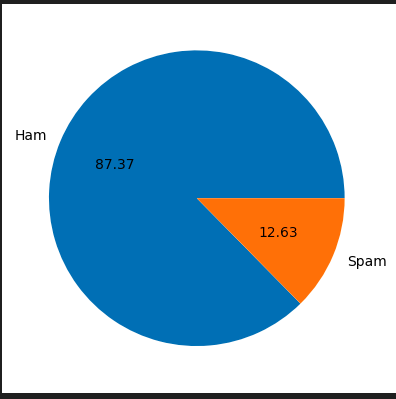
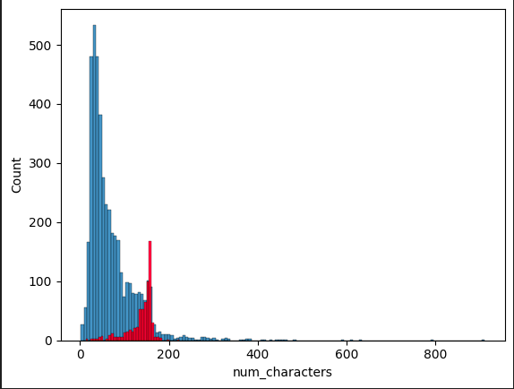
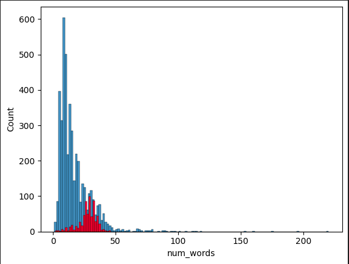
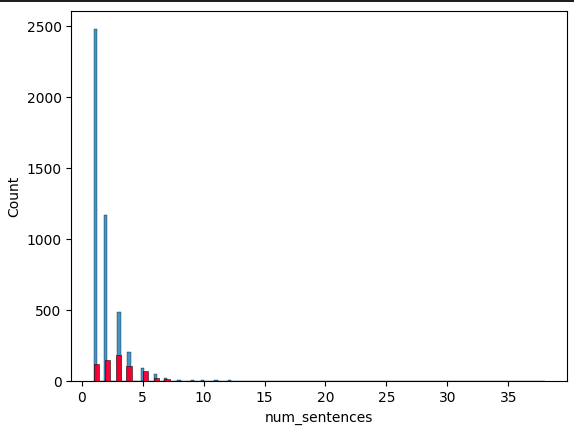
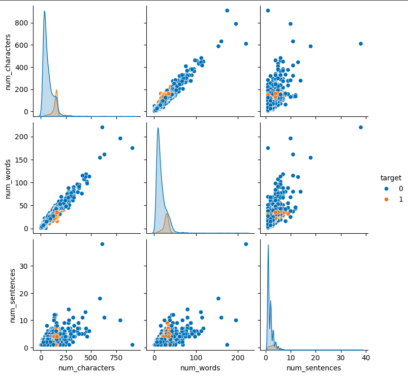
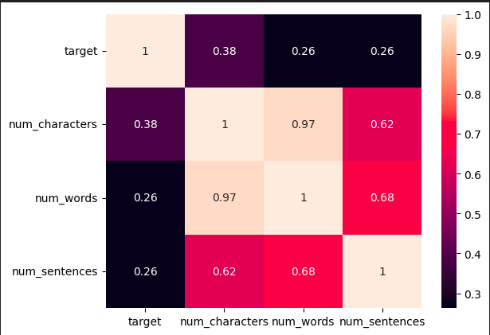
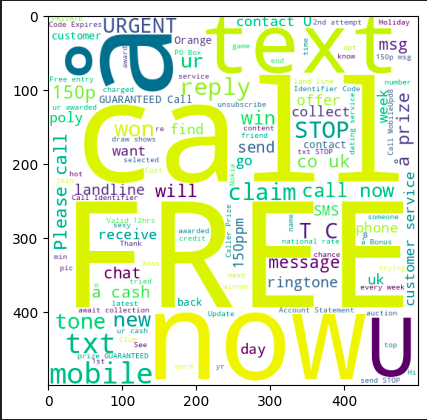
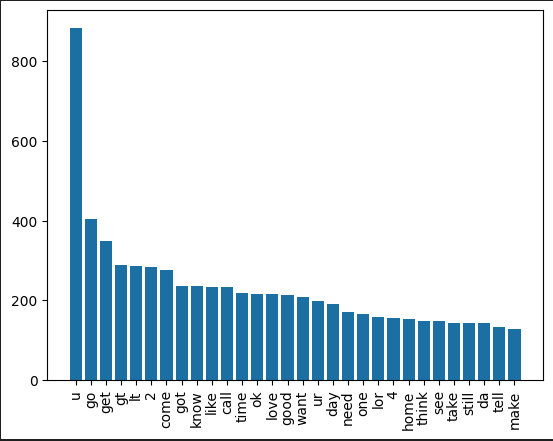

# 📩 SMS Spam Detector

A **NLP & Machine learning–powered web application** that classifies SMS messages as **Spam** or **Ham (Not Spam)**.  
Built using **Python**, **scikit-learn**, and **Streamlit**, and trained on a real-world dataset from Kaggle.

🚀 **Live App:**  
👉 https://smsspamdetector-rddswm7fxetzc2g9b7xzce.streamlit.app/

---

## 🧠 Project Overview

Spam messages are a real problem—annoying at best, dangerous at worst.  
This project applies **NLP & Machine Learning** to automatically detect spam SMS messages.

The model is trained on labeled SMS data and deployed as an interactive web app where users can test messages in real time.

---

## 📊 Dataset

- **Source:** Kaggle  
- **Dataset Name:** SMS Spam Collection Dataset  
- **Link:** https://www.kaggle.com/datasets/uciml/sms-spam-collection-dataset  
- **Size:** 5,572 SMS messages  
- **Classes:** `spam`, `ham`
---

## 📊 Graphs & Plots

<table>
  <tr>
    <td><H2>Spam VS Ham Pie Chart</H2></td>
    <td><H2>Numbers & Character Count</H2></td>
    
  </tr>
    <tr>
    <td><H2>Numbers & Words Count</H2></td>
    <td><H2>Numbers & Sentences Count</H2></td>
    
  </tr>
    </tr>
    <tr>
    <td><H2>Correlation Between all the Columns</H2></td>
    <td><H2>Heatmap of all the Columns</H2></td>
    
  </tr>
      <tr>
    <td><H2>Top Most Occuring Words in Spam</H2></td>
    <td><H2>World Cloud Of Spam</H2></td>
    
  </tr>
        <tr>
    <td><H2>Top Most Occuring Words in Ham</H2></td>
    <td><H2>World Cloud Of Ham</H2></td>
    
  </tr>
</table>


---
## 📊 Model Performance Summary

| Model                | Vectorization | Precision Score | Accuracy Score |
|----------------------|---------------|-----------------|----------------|
| Gaussian Naive Bayes | CountVectorizer       | 53.15%          | 88%         |
| Multinomial Naive Bayes | CountVectorizer       | 83.44%          | 96.42%         |
| Bernoulli Naive Bayes | CountVectorizer       | 97.34%          | 97%         |
| Gaussian Naive Bayes | TfidVectorizer       | 52.31%          | 87.62%         |
| **Multinomial Naive Bayes** | **TfidVectorizer**       | **100%**          | **95.93%**         |
| Bernoulli Naive Bayes | TfidVectorizer       | 97.34%          | 97%         |
| SVC | TfidVectorizer       | 97.41%          | 97.29%         |
| KNeighborsClassifier | TfidVectorizer       | 100%          | 90.03%         |
| DecisionTreeClassifier | TfidVectorizer       | 83.01%          | 93.42%         |
| LogisticRegression | TfidVectorizer       | 94%          | 95.16%         |
| RandomForestClassifier | TfidVectorizer       | 100%          | 97.19%         |
| AdaBoostClassifier | TfidVectorizer       | 84.09%          | 92.45%         |
| BaggingClassifier | TfidVectorizer       | 86.25%          | 95.84%         |
| ExtraTreesClassifier | TfidVectorizer       | 98.24%          | 97.29%         |
| GradientBoostingClassifier | TfidVectorizer       | 92.38%          | 95.26%         |
| XGBClassifier | TfidVectorizer       | 95.16%          | 97.48%         |

---
## 📊 Model Improvement

1. Changing the **max_features parameter of TfidfVectorizer**

    - **Best Param** Max_features = 3000
   
    - Using with **Multinomial Naive Bayes**
   
    - Precision Score :- 100%
   
    - Accuracy Score :- 97.09%

2. Scaling the Data using **MinMaxScaler**

    - Using with **Multinomial Naive Bayes**
   
    - Precision Score :- 94.61%
   
    - Accuracy Score :- 97.87%

3. Using **Voting Classifier**

    - Using with **SVC** , **Multinomial Naive Bayes** , **ExtraTreesClassifier**
      
    - Precision Score :- 96.82%
   
    - Accuracy Score :- 98.06%

---

## ✔️ Final Model Selected (model.pkl)

  **TfidfVectorizer** With **Max_features = 3000** with **Multinomial Navie Bayes**
  
  - Precision Score :- 100%
   
  - Accuracy Score :- 97.09%

---

## ⚙️ Tech Stack

- **Language:** Python 🐍  
- **Machine Learning:** scikit-learn  
- **NLP:** TF-IDF Vectorization  
- **Web Framework:** Streamlit  
- **Model Serialization:** Pickle  
- **Deployment:** Streamlit Cloud  

---
## ⚙️ Work Flow
 1. Data Cleaning
 2. Exploratory Data Analysis(EDA)
 3. Text Preprocessing
 4. Model Building
 5. Evalution
 6. Improvement
 7. Website
 8. Deployment
---

## 🧪 Model Pipeline

1. Text Cleaning & Preprocessing  
2. TF-IDF Vectorization  
3. Supervised Classification  
4. Model Evaluation  
5. Model & Vectorizer Serialization  

Saved files:
- `model.pkl` → trained ML model  
- `vectorizer.pkl` → TF-IDF vectorizer  

---

## 🗂️ Repository Structure

```text
SMS_Spam_Detector/
│
├── Data/                      # Dataset files
├── EDA/                       # Graphs & Plots
├── app.py                     # Streamlit web app
├── sms_spam_detection.ipynb   # Model training & analysis
├── model.pkl                  # Trained ML model
├── vectorizer.pkl             # TF-IDF vectorizer
├── requirements.txt           # Project dependencies
├── README.md                  # Project documentation
└── LICENSE                    # License file
```
# ▶️ How to Run Locally

## 1️⃣ Clone the repository

```text
git clone https://github.com/SatyamKumar457/SMS_Spam_Detector.git
cd SMS_Spam_Detector
```

## 2️⃣ Install dependencies

```text
pip install -r requirements.txt
```
## 3️⃣ Run the Streamlit app

```text
streamlit run app.py

```
## 🖥️ Web App Features

- 📝 Enter any SMS message

- ⚡ Instant prediction

- ✅ Clear Spam / Not Spam output

- 🌐 Deployed and accessible online

## 📈 Results

The trained model achieves strong accuracy on unseen data and performs well for real-world SMS classification tasks.

This project focuses on practical deployment, not just notebook accuracy.

## 👤 Author

**Satyam Kumar**

- **GitHub:** https://github.com/SatyamKumar457
  
- **LinkIn:** https://www.linkedin.com/in/satyam-kumar-a01959326/

## 📜 License

This project is licensed under the MIT License.

Feel free to use, modify, and distribute.
